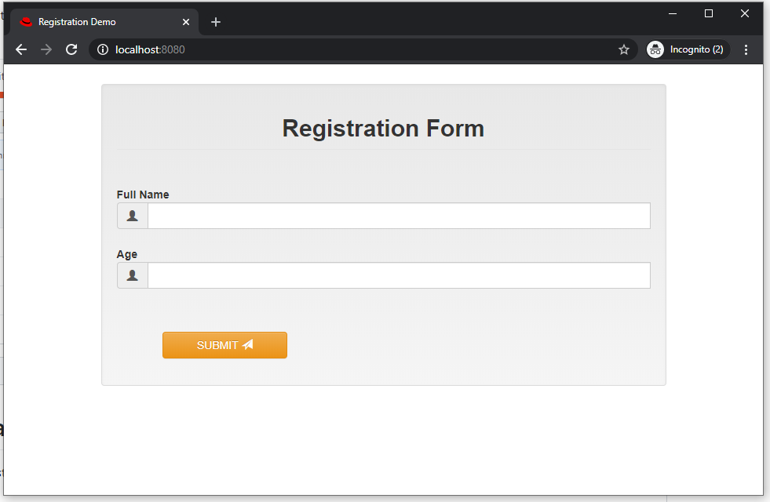
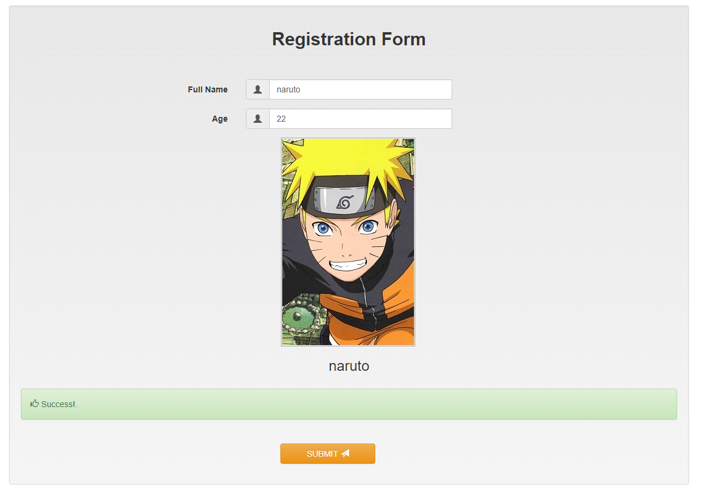

Red Hat Process Automation Manager Front End Example 01
=======================

A simple registration frontend for displaying how integration between frontend and RHPAM works. 

## Tools
- Golang
- Docker

## screenshot

#### Registration UI

----

#### After Registration UI
